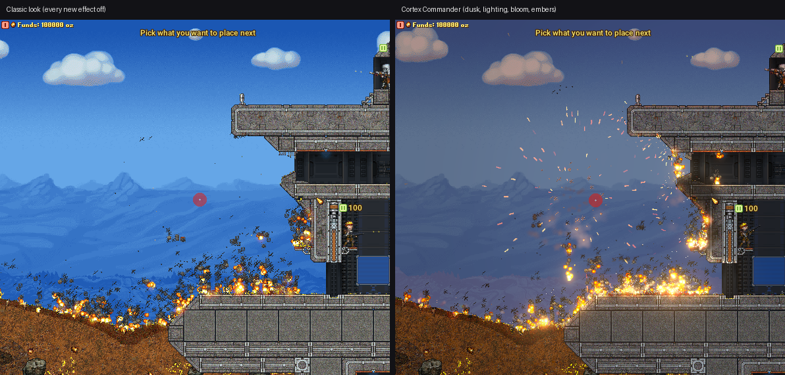
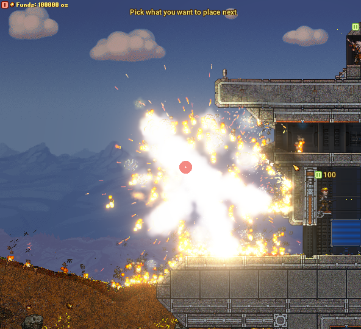
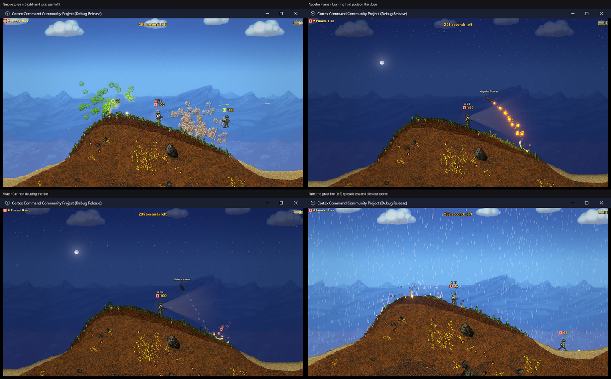
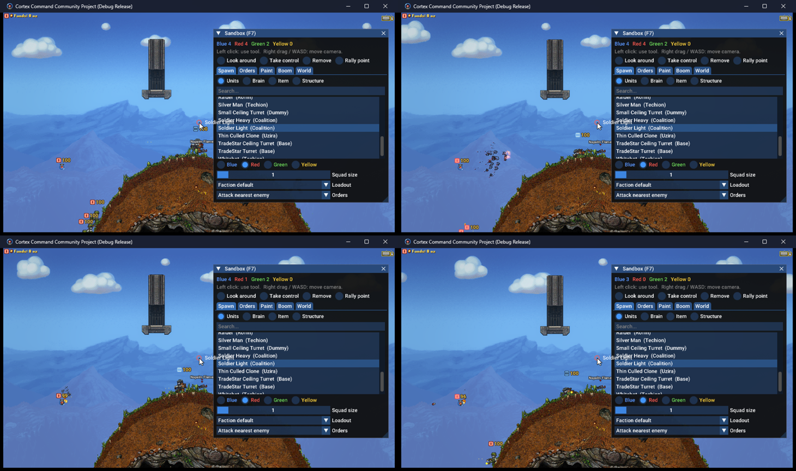

# Cortex Commander

**Cortex Command, relit and expanded.** This fork of the [Cortex Command Community Project](https://github.com/cortex-command-community/Cortex-Command-Community-Project) gives the game a modern lighting and effects renderer, adds new simulation systems (spreading fire, flowing liquids, collapsing terrain, burning soldiers, weather that matters) and a full god-mode **Sandbox**. It keeps the crisp pixel art, the destructible terrain and every existing mod working.

*Free and open source under the GNU AGPL v3, like the project it's built on.*

---

## Credit where it's due

- **Data Realms** made Cortex Command and released it as open source.
- The **[Cortex Command Community Project](https://github.com/cortex-command-community/Cortex-Command-Community-Project)** developers have kept it alive for years. They ported it to modern platforms, rewrote huge parts of the engine, added Lua scripting, mod support, the GPU renderer this fork builds on, and much more.

Everything here sits on top of their work, and all of their commit history is kept intact in this repository. If you want the official game, get it from the [Community Project website](https://cortex-command-community.github.io/downloads). This fork isn't affiliated with or endorsed by either of them.

---

## How Cortex Commander differs from the original

The Community Project's priority is a stable, faithful, multi-platform Cortex Command. That's the right priority for the official game, but it means big visual and gameplay changes move slowly. This fork takes a different approach:

- **Visuals first.** The aim is "a pixel-art diorama under real light": dark caves that are actually dark, muzzle flashes that light up tunnel walls, explosions that bloom and push heat haze outwards, sunlight that fades as you dig down.
- **The pixels stay.** The world is still drawn at the game's internal resolution and scaled up crisply. Only the light, bloom and post-processing get the high-resolution treatment.
- **Old content gets better for free.** The game ships thousands of sprites and hundreds of INI files that nobody is going to redraw. Every new effect works automatically on existing content and mods: glows become lights, terrain gets edge normals, smoke scatters light. Mods can opt into more (lights on objects, glow blend modes, scene atmosphere).
- **New simulation that stays deterministic.** Fire, liquids, collapse, smoke and burning units are real simulation systems, not just visuals. They run in fixed steps with their own seeded random numbers and sorted update order, so the game stays deterministic.
- **Everything can be switched off.** A *Classic* setting turns the new look off entirely, and every gameplay system (fire, liquids, collapse, smoke blocking sight, burning units) is a separate setting.
- **Tested.** A render-test harness with golden-image comparisons, scripted gameplay tests and soak tests checks every change against the original look and for crashes or leaks.
- **Built on the upstream GPU renderer.** This fork starts from the Community Project's in-progress OpenGL renderer branch, brings it up to parity, and builds the lighting on top. It isn't a separate engine.

---

## What's new

### Lighting and visuals
- **HDR scene lighting:** sky light that falls off underground, dynamic lights from every glow, muzzle flash and explosion with soft terrain shadows, edge-lit sprites, and an emissive palette so tracers, gold and hot metal glint in the dark.
- **2D global illumination** (radiance cascades, Ultra preset): fire and lamps light their surroundings, with bounce light.
- **Post-processing:** bloom, tonemapping, colour grading, heat haze, explosion shockwaves, god rays through gaps in the terrain, atmospheric haze, scorch marks and glowing crater rims, embers, and light scattering in smoke.
- **Time of day and weather:** a day/night cycle with stars, moon and lightning in storms. Rain darkens the ground, and snow settles on it and melts.
- **Living world:** vegetation sways in the wind and bends in blast waves. Blood and oil stain terrain. Explosions throw sparks, dust and debris chips.
- **Night gameplay:** soldiers wear headlamps after dark, AI sight shrinks at night, and there's a buyable Flare.
- **Photo mode (F8):** freeze time, free camera, look sliders, and screenshots at up to 4x internal resolution.
- **Quality of life:** an optional modern HUD (minimap, health and ammo bars, kill feed), crisp TTF text, smooth screen shake, sharp upscaling, quality presets, and soft fog of war restored.

### New simulation systems
- **Spreading fire:** grass and vegetation burn away, wood burns to ash, oil burns fast. It climbs, spreads downwind, is damped by rain and snow, and is put out by water.
- **Flowing liquids:** water, lava, acid and oil flow and pool. Water puts out fire, lava sets things alight and turns to stone in water, and acid eats soft ground.
- **Collapsing terrain:** pieces blasted loose fall as rigid chunks. Concrete and metal structures hold.
- **Burning soldiers:** units catch fire, panic, run and spread it, until they burn out or hit water. Water on fire throws up **steam**, which blocks sight.
- **Smoke and gas block sight:** units can't see through thick smoke, so smoke screens actually work.
- **Weather matters:** rain and snow damp fire, snow slows soldiers down, and wind drives fire and embers.
- **Saved games** keep burning fire and flowing liquid.

### New gear
Smoke Grenade, Toxic Gas Grenade, Flare, **Napalm Flamer** (burning fuel that pools), **Water Cannon** (knockback, puts fires out), **Acid Sprayer**, and the **Fuel Barrel** (leaks oil when shot, explodes in burning fuel).

### Sandbox mode
Pick **Sandbox** in the scenario menu and play as a god:
- **Spawn anything:** units from every faction (with squad size, loadout and orders), brains, items, and bunkers through the game's own build menu, for four sides.
- **Drop squads** by dropship or rocket. Run **auto battles** where each side gets a faction and a budget and the AI buys and sends waves until one side is left.
- **Command** units: box-select them, then click to move or attack. **Follow** a unit, or let the camera follow the action. **Take control** of any unit yourself.
- **Paint** fire, water, lava, acid, oil, smoke, gas and terrain. Call down grenades, bombs, napalm and **lightning**.
- **Pause AI** to set up a battlefield in peace, then let everyone loose.
- Change the weather and time of day, and use slow motion.
- Scriptable from Lua (`SandboxDo`, `SandboxAutoBattleSide`, `SandboxPauseAI`, ...).

### Fixes along the way
- Loading saved games works again.
- Fixed the invisible pie menu and inventory carousel on the GPU renderer.
- Fixed missing scenario map markers.
- Fixed copied presets with their own sprites drawing the wrong frames.
- Fixed black frames when the window was exposed.

---

## Controls and where things are

| Key | What it does |
|---|---|
| **F6** | World Debug: time of day, weather, lighting toggles, gameplay systems, game speed, Pause AI |
| **F7** | Sandbox tools (the whole game in Sandbox mode, a debug panel elsewhere) |
| **F8** | Photo mode |
| *Video settings* | Lighting, Bloom, Extra Effects and quality presets. Turn them off for the classic look. |

Full details of every setting, the INI properties for modders and the Lua API are in **[Documentation/LightingAndEffects.md](Documentation/LightingAndEffects.md)**. The design and history are in [MODERNISATION_PLAN.md](MODERNISATION_PLAN.md) and [FEATURE_PROPOSAL.md](FEATURE_PROPOSAL.md).

---

## Status

- **A work in progress,** developed and tested on **Windows** (Visual Studio 2022, OpenGL 3.3). New source files are added to the meson build for Linux and macOS, but those builds haven't been tested here yet.
- **No prebuilt releases yet.** Build it from source (below). The game data is included in the repository.
- **Mods** that work with the Community Project should work here too.
- **How it's made:** this fork is developed with the help of AI coding assistance (Claude Code), with every change built and tested in the game. The commit history records what changed and why.
- **Deferred for now:** camera zoom, an SDL_GPU backend, and per-material specular highlights. The reasons are in FEATURE_PROPOSAL.md.

Bug reports and ideas are welcome in this repository's issues. Please report problems with the base game to the [Community Project](https://github.com/cortex-command-community/Cortex-Command-Community-Project/issues) instead.

---

*The build instructions below are inherited from the Community Project and apply to this fork as well. The Visual Studio solution is `RTEA.sln`. Use the `Final` configuration for a playable build, which produces `Cortex Command.exe` in the repository root.*

# Windows Build Instructions
First you need to download the necessary files:

1. Install the necessary tools.  
You'll probably want [Visual Studio Community Edition](https://visualstudio.microsoft.com/downloads/) (build supports 2019 (>=16.10) and 2022 versions. Earlier versions are not supported due to lack of C++20 standard library features and conformance).  
You also need to have both x86 and x64 versions of the [Visual C++ Redistributable for Visual Studio 2015-2022](https://support.microsoft.com/en-us/help/2977003/the-latest-supported-visual-c-downloads) installed in order to run the compiled builds.  
You may also want to check out the list of recommended Visual Studio plugins [here](https://github.com/cortex-command-community/Cortex-Command-Community-Project/wiki/Information,-Recommended-Plugins-and-Useful-Links).

2. Clone this Repository into a folder.  

3. Copy the `fmod.dll` library from `Cortex-Command-Community-Project\external\lib\win` into the root directory.

Now you're ready to build and launch the game.  
Simply open `RTEA.sln` with Visual Studio, choose your target platform (x86 or x64) and configuration, and run the project.

* Use `Debug Full` for debugging with all visual elements enabled (builds fast, runs very slow).
* Use `Debug Minimal` for debugging with all visual elements disabled (builds fast, runs slightly faster).
* Use `Debug Release` for a debugger-enabled release build (builds slow, runs almost as fast as Final. **Debugging may be unreliable due to compiler optimizations**).
* Use `Final` to build release executable.

The first build will take a while, but future ones should be quicker.

If you want to use an IDE other than Visual Studio, you will have to build using meson. Check the [Linux](#building) and [Installing Dependencies](#installing-dependencies) section for pointers.

## Windows Subsystem for Linux (WSL)

The Linux build can be built and run on Windows 10 using WSL by following the Linux [building](#building) and [running](#running) instructions.  
Information on installing and using WSL can be found [here](https://learn.microsoft.com/en-us/windows/wsl/install).

Building can be done directly from the Windows filesystem side, without having to clone the repositories on the Linux filesystem side.  
By default WSL will mount your `C:` drive to `/mnt/c/`, or just `/c/`. From there you can navigate to the Source and Data directories to follow the meson build steps.

This has been tested with WSL2 Ubuntu 22.04 but should work with other distributions and WSL1 as well.

***

# Linux and macOS Build Instructions
The Linux build uses the meson build system, and builds against system libraries.

## Dependencies

* [`meson`](https://www.mesonbuild.com)`>= 1.6.0` (`pip install meson`/`brew install meson` if your distro doesn't include a recent version)
* `ninja`
* `gcc`, `g++` (>=13, clang unsupported) 
* `opengl` (usually provided by the gpu driver)
* `flac`
* `luajit`
* `lua` (maybe optional)
* `minizip`
* `tbb`
* `lz4>=1.9.0`
* `libpng`
* `dylibbundler` (required only if installing on macOS)

For unspecified versions assume compatibility with the latest ubuntu LTS release.

## Building

1. Install Dependencies (see [below](#installing-dependencies) for instructions).

2. Clone this Repository and open a terminal in it.

3. `meson setup build` or `meson setup --buildtype=debug build` for debug build (default is release build)  
	For macOS you need to specify gcc, with `env CC=gcc-13 CXX=g++-13 meson setup build`

4. `ninja -C build`

5. (optional) `sudo ninja install -C build` (To uninstall later, keep the build directory intact. The game can then be uninstalled by `sudo ninja uninstall -C build`)

If you want to change the buildtype afterwards, you can use `meson configure --buildtype {release or debug}` in the build directory or create a secondary build directory as in Step 3. There are also additional build options documented in the [wiki](https://github.com/cortex-command-community/Cortex-Command-Community-Project/wiki/Meson-build-options) as well as through running `meson configure` in the build directory.

## Running
(If you installed the game in step 5 above, it should appear with your regular applications and will just run)

1. (*optional*) Copy (link) all `libfmod` files from `external/lib/[os]/[arch]` into the repository.
  - Linux: `cd $REPOSITORY; ln -s ../external/lib/linux/x86_64/libfmod.so* .`
  - macOS: `cd $REPOSITORY; ln -s ../external/lib/macOS/libfmod.dylib .`

2. Run `./CortexCommand` or `./CortexCommand_debug`.

## Installing Dependencies

**macOS additional dependencies:**  
- `brew` [brew.sh](https://brew.sh) (or any other package manager)  
- `Xcode` or `Command Line Tools for Xcode` (if you need to, you can also generate an xcode project from meson using the `--backend=xcode` option on setup)

**Homebrew (macOS):**  
`brew install pkg-config sdl3 minizip lz4 flac luajit lua libpng tbb gcc@13 ninja meson dylibbundler`

**Arch Linux:**  
`sudo pacman -S tbb flac luajit lua minizip lz4 libpng meson ninja base-devel`  

**Ubuntu >=22.04:**  
`sudo apt-get install build-essential libflac++-dev luajit-5.1-dev liblua5.1-dev libminizip-dev liblz4-dev libpng++-dev libtbb-dev ninja-build python3-pip`  
`sudo python3 -m pip install meson`

**Fedora:**  
`# dnf install allegro-loadpng-devel allegro-devel libsdl2-devel SDL2_image-devel lua-devel boost-devel meson ninja-build flac-devel luajit-devel minizip-compat-devel tbb-devel lz4-devel libpng-devel lua-devel gcc gcc-c++`  

## Troubleshooting

* older versions of `pipewire(-alsa)` and fmod don't work well together, so the game might [not close, have no sound or crash](https://gitlab.freedesktop.org/pipewire/pipewire/-/issues/1514). Workaround by `ln -s /bin/true /usr/bin/pulseaudio`

***
## Debugging with VS Code

This repository includes launch configurations to automatically build and debug the game using [VS Code](https://code.visualstudio.com/) on any of the supported platforms using one of the two supported build systems.

### Requirements
- [C/C++ Extension Pack](https://marketplace.visualstudio.com/items?itemName=ms-vscode.cpptools-extension-pack) extension (all platforms) 

#### msbuild *(Windows only)*
  - [msbuild command line tools](https://learn.microsoft.com/en-us/visualstudio/msbuild/msbuild?view=vs-2022) (available [here](https://visualstudio.microsoft.com/downloads/?q=build+tools#build-tools-for-visual-studio-2022)), available on system `PATH`
  - The `fmod.dll` library must be copied to the **Data Repository** (as above)
  
#### meson *(All platforms)*
  - meson, [as above](#dependencies), available on the system `PATH`
  - The [meson editor extension](https://marketplace.visualstudio.com/items?itemName=mesonbuild.mesonbuild) 
  - Run the provided `Setup Meson` task, found via the command palette -> `Tasks: Run Task`
  - Windows:
    - [Visual Studio (2022) C++ Build Tools](https://visualstudio.microsoft.com/downloads/?q=build+tools#build-tools-for-visual-studio-2022) (`MSVC v143`)
    - The `fmod.dll` library must be copied to the **Data Repository** (as above)
  - Linux:
    - [All the dependencies listed above](#dependencies)
  - macOS:
    - [All the dependencies listed above](#dependencies)
    - The [`lldb`](https://lldb.llvm.org/) debugger 

These launch configurations are accessible via the [Run and Debug](https://code.visualstudio.com/docs/editor/debugging#_run-and-debug-view) view, and provide profiles to build and run the game in Release mode or any of the [3 Debug modes](https://github.com/cortex-command-community/Cortex-Command-Community-Project/wiki/Meson-build-options). 

All configurations will run pre-launch tasks to build the game using the supported backend before launching.

## SAST Tools

[PVS-Studio](https://pvs-studio.com/en/pvs-studio/?utm_source=website&utm_medium=github&utm_campaign=open_source) - static analyzer for C, C++, C#, and Java code.
